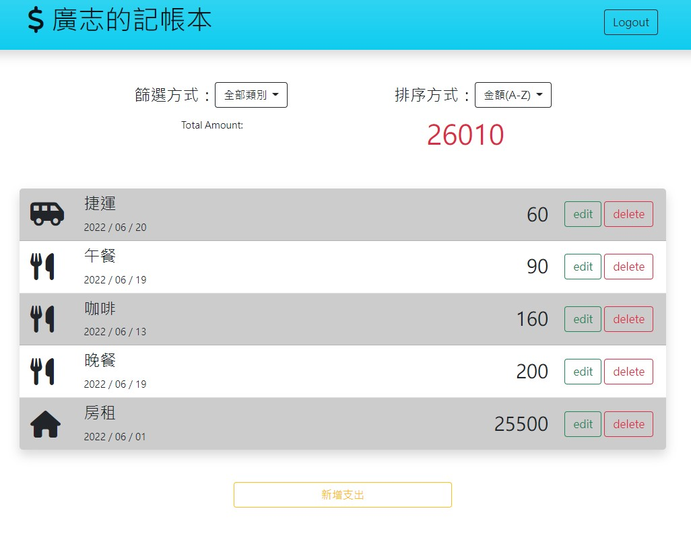

# 我的記帳本

# 介紹
記錄使用者的支出，紀錄消費項目、日期及金額，提供加總及使用者帳號登入功能。
# 功能
1.使用者可以註冊帳號  
2.使用者登入後可以查閱自己的支出資訊  
3.使用者可以對資料進行新增、修改、刪除  
7.使用者可以以日期、金額或消費種類排序資料  
# 開始使用
1.請確認已安裝Node.js及npm  

2.使用終端機((Terminal)將專案clone到本機位置  

``` bash
git clone https://github.com/coldfish5630/expense-tracker.git
```

3.安裝套件

```bash
npm install
```

4.在/expense-tracker新增.env，請參考.env.example設定環境變數

5.新增種子資料，看到category done及record done表示新增完成

```bash
npm run seed
```

6.完成後開啟程式

```bash
npm run start
```

7.看到下列訊息表示程式已正常開啟，請使用瀏覽器進入該網址http://localhost:3000

```bash
express is running on http://localhost:3000
mongodb connected
```

8.若要關閉程式請使用ctrl + c
# 使用工具
Node.js  
Express  
Express-Handlebars  
mongoose  
passport  
bcryptjs  
